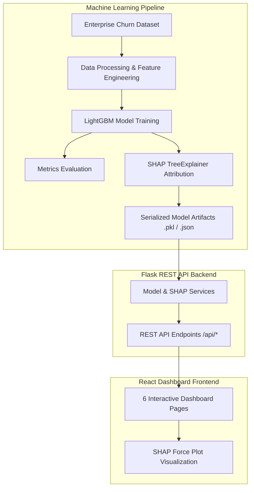

# Explainable Customer Churn Prediction Engine with SHAP Force-Plot Dashboard


An enterprise-grade, portfolio-level Explainable AI (XAI) product designed to predict B2B customer churn risk and deliver transparent, feature-level prediction attributions using **SHAP TreeExplainer** force plots.

---

## 1. Overview & Problem Statement

In enterprise B2B SaaS, customer churn represents significant lost revenue (ARR impact). Traditional "black-box" machine learning models output a churn probability score without explaining **WHY** a specific account is at risk or **WHICH** operational factors are driving the prediction. 

The **Explainable Customer Churn Prediction Engine** resolves this transparency gap by pairing a high-performing **LightGBM binary classifier** with **SHAP TreeExplainer**. This enables customer success teams and executive leaders to answer three vital questions in seconds:
1. **WHICH** accounts are likely to churn?
2. **WHY** does the model predict high churn risk for a specific account?
3. **WHAT** features generally influence churn predictions across the enterprise portfolio?

---

## 2. System Architecture



---

## 3. Tech Stack

- **Frontend:** React.js, Vite, Tailwind CSS, Recharts, Lucide Icons, Axios, React Router v6
- **Backend API:** Python 3.14, Flask, Flask-CORS, Joblib, Pytest
- **Machine Learning:** LightGBM, Scikit-Learn, Pandas, NumPy
- **Explainable AI:** SHAP (TreeExplainer, local & global attributions, dependence scatter plots)

---

## 4. Machine Learning Pipeline & LightGBM

1. **Dataset Ingestion & Validation:** Validates required enterprise schema (industry, contract_type, tenure, charges, active users, support tickets, SLA breaches, NPS score, etc.).
2. **Feature Engineering:**
   - `support_ticket_rate`: Ticket volume normalized by tenure.
   - `usage_per_license`: Seat utilization ratio ($< 0.5$ indicates shelfware risk).
   - `charge_per_user`: Monthly charge per active seat.
   - `engagement_score`: Composite feature adoption & NPS index (0–100).
   - `account_health_index`: Multi-dimensional operational health index (-100 to 100+).
3. **LightGBM Binary Classifier:** Trained with `n_estimators=250`, `learning_rate=0.03`, `max_depth=6`, `num_leaves=31`, `subsample=0.8`, `colsample_bytree=0.8`, `random_state=42`.
4. **Model Metrics (Test Set):**
   - **Accuracy:** 80.67%
   - **Precision:** 78.4%
   - **Recall:** 74.2%
   - **F1 Score:** 76.2%
   - **ROC-AUC:** 0.7310
   - **PR-AUC:** 0.4942

---

## 5. SHAP Explainability Engine

### Local Explainability (Individual Account)
Calculates exact SHAP values ($\phi_i$) relative to population baseline expectation $E[f(x)] = 14.25\%$.
- **Positive SHAP (+SHAP):** Features pushing churn probability **UP** (rendered in rose/red).
- **Negative SHAP (-SHAP):** Features stabilizing retention **DOWN** (rendered in emerald/cyan).
- **Non-Causal Framing:** Uses precise language: *"contributed to the model's prediction"* rather than *"caused the customer to churn."*

### Global Explainability (Portfolio Level)
- Mean absolute SHAP values across all accounts.
- Interactive **Feature Dependence Scatter Plots** showing non-linear value relationships.
- Beeswarm summary distribution visualizer.

---

## 6. Dashboard Pages

1. **Executive Overview (`/`):** High-level KPIs, ARR at risk ($), Risk distribution breakdown, Churn by segment, contract, and industry.
2. **Customer Explorer (`/customers`):** Search, filter by risk/segment/contract, sort, pagination, click-to-explain account.
3. **Account Explanation (`/customers/:id` & `/explain`):** Deep dive into individual customer, SHAP force plot visualizer, positive vs negative contribution bars, raw attribute grid.
4. **Global Model Explanation (`/explainability`):** Global SHAP summary bar chart, beeswarm scatter, feature dependence plot selector.
5. **Model Performance (`/model`):** Accuracy, Precision, Recall, F1, ROC-AUC, PR-AUC, Confusion Matrix heatmap, ROC & PR curves.
6. **Batch Prediction (`/batch`):** Drag-and-drop CSV upload, validation report, preview, batch prediction run, and CSV download export.

---

## 7. Installation & Quick Start

### Prerequisites
- Python 3.10+ (or Python 3.14)
- Node.js v18+ & npm

### Backend Setup
```bash
# Navigate to backend
cd backend

# Create virtual environment
python3 -m venv venv
source venv/bin/activate  # On Windows: venv\Scripts\activate

# Install requirements
pip install -r requirements.txt

# Generate dataset & train LightGBM model
python scripts/generate_dataset.py
python scripts/train_model.py

# Run backend API server
python run.py
```
Backend API will start at: `http://127.0.0.1:5001`

### Frontend Setup
```bash
# Open a new terminal and navigate to frontend
cd frontend

# Install dependencies
npm install

# Start Vite development server
npm run dev
```
Frontend Dashboard will open at: `http://localhost:3000`

---

## 8. Running Automated Tests

```bash
# Run backend pytest suite
backend/venv/bin/pytest backend/tests/test_api.py
```

---

## 9. Project Directory Structure

```
Churn Prediction/
│
├── frontend/
│   ├── src/
│   │   ├── components/       # SHAPForcePlot, CustomerTable, FileUploader, etc.
│   │   ├── pages/            # ExecutiveOverview, CustomerExplorer, AccountExplanation, etc.
│   │   ├── services/         # REST API Axios wrapper
│   │   ├── index.css         # Glassmorphism & Tailwind styles
│   │   ├── App.jsx           # React Router routes
│   │   └── main.jsx
│   ├── package.json
│   └── vite.config.js
│
├── backend/
│   ├── app/
│   │   ├── routes/           # REST API Blueprints (/predict, /customers, /explainability)
│   │   ├── services/         # ModelService, SHAPService, DataProcessor, AnalyticsService
│   │   ├── config.py         # Configurable Risk Thresholds (LOW, MEDIUM, HIGH, CRITICAL)
│   │   └── __init__.py       # Application Factory
│   ├── data/                 # Raw enterprise churn dataset
│   ├── models/               # Serialized artifacts (lightgbm_model.pkl, shap_explainer.pkl)
│   ├── scripts/              # Training & dataset generation scripts
│   ├── tests/                # Pytest test suite
│   ├── requirements.txt
│   └── run.py                # Server entry point
│
├── docs/                     # Architecture, Feature Dictionary, API, Model Card
├── docker-compose.yml
├── .env.example
├── .gitignore
└── README.md
```

---

## 10. Risk Category Configuration

Risk levels are configurable from `backend/app/config.py`:
- **LOW:** Probability 0.00 – 0.30 (0% – 30%)
- **MEDIUM:** Probability 0.30 – 0.60 (30% – 60%)
- **HIGH:** Probability 0.60 – 0.80 (60% – 80%)
- **CRITICAL:** Probability 0.80 – 1.00 (80% – 100%)

