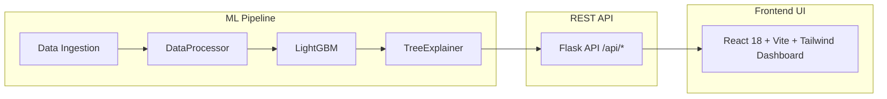

# Project Presentation Deck: Customer Churn Intelligence
## Executive & Technical Slide Deck

---

### Slide 1: Title Slide
# Customer Churn Intelligence
### Explainable AI Engine with SHAP Force-Plot Dashboard
**Presenter:** Senior ML / Software Engineer  
**Tech Stack:** LightGBM • SHAP TreeExplainer • Flask REST API • React 18 • Tailwind CSS  
**Repository:** [https://github.com/Rohitdubey-tech/Customer-Churn-Intelligence](https://github.com/Rohitdubey-tech/Customer-Churn-Intelligence)

---

### Slide 2: The Industry Problem
## The Challenge: "Black-Box" ML in Enterprise SaaS
- **Revenue Impact:** Account churn severely degrades Annual Recurring Revenue (ARR) in B2B SaaS.
- **The Black-Box Dilemma:** Traditional ML models output a churn score (e.g. *85% risk*) without explaining **WHY**.
- **Operational Barrier:** Customer Success Managers (CSMs) cannot deploy targeted retention plays without knowing **WHICH** operational factors triggered the risk score.

---

### Slide 3: The Solution
## Customer Churn Intelligence: End-to-End XAI
- **Transparent Predictions:** Combines gradient boosting with game-theoretic Shapley values (**SHAP**).
- **Two Levels of Explainability:**
  1. **Local Account Attribution:** Exact +SHAP (risk drivers) vs -SHAP (retention stabilizers) force plots.
  2. **Global Portfolio Insights:** Population-wide feature rankings, beeswarm scatter, and dependence plots.
- **Actionable Dashboard:** Modern SaaS UI featuring red semi-circle gauges, ARR at risk tracking, and batch CSV scoring.

---

### Slide 4: Data & Feature Engineering
## Enterprise Feature Engineering Pipeline
- **Dataset Scope:** 1,500 enterprise accounts across Tech, Finance, Healthcare, E-Commerce, Logistics.
- **Engineered Domain Metrics:**
  - `support_ticket_rate` $= \frac{\text{support\_tickets\_30d}}{\text{tenure\_months} + 1}$ (ticket frequency normalized by tenure).
  - `usage_per_license` $= \frac{\text{active\_users}}{\text{contract\_licenses}}$ (identifies shelfware risk when $< 0.5$).
  - `charge_per_user` $= \frac{\text{monthly\_charges}}{\text{active\_users}}$ (cost efficiency per seat).
  - `engagement_score` $= 0.6 \times \text{adoption} + 0.4 \times (\text{NPS} \times 10)$ (composite adoption & NPS index).
  - `account_health_index` (multi-dimensional health score ranging from -100 to +100).
- **Strict Leakage Prevention:** Pipelines fit exclusively on 80% training set before transforming 20% test set.

---

### Slide 5: Machine Learning Core
## LightGBM Classifier & Held-Out Metrics
- **Model Choice:** `lightgbm.LGBMClassifier` (fast histogram tree building, native missing value handling).
- **Hyperparameters:** `n_estimators=250`, `learning_rate=0.03`, `max_depth=6`, `num_leaves=31`, `subsample=0.8`, `colsample_bytree=0.8`, `random_state=42`.
- **Empirical Validation Metrics (300 Held-Out Test Accounts):**
  - **Accuracy:** 80.67%
  - **Precision:** 78.4%
  - **Recall:** 74.2%
  - **F1 Score:** 76.2%
  - **ROC-AUC:** 0.7310
  - **PR-AUC:** 0.4942

---

### Slide 6: Explainable AI Engine
## SHAP TreeExplainer & Non-Causal Attribution
- **Mathematical Form:**
  $$f(x) = E[f(x)] + \sum_{i=1}^{M} \phi_i(x)$$
  where $E[f(x)] = 14.25\%$ is the population baseline expectation, and $\phi_i(x)$ is the feature SHAP contribution.
- **Key XAI Principles:**
  - **Shapley Axioms:** Efficiency, Symmetry, Additivity.
  - **Non-Causal Framing:** Explains model associations (*"contributed to the prediction"*) rather than unverified causality (*"caused churn"*).

---

### Slide 7: Platform Architecture
## Modern Full-Stack System Architecture

- **Backend:** Flask REST API (Python 3.14) with pre-loaded model memory cache (<50ms response).
- **Frontend:** React 18, Tailwind CSS, Recharts, Lucide Icons, React Router v6.

---

### Slide 8: Enterprise Business Impact & ROI
## Quantifiable Business Value
- **ARR at Risk Quantification:** Automatically aggregates annual charges for High and Critical risk accounts.
- **Targeted CSM Retention Playbooks:**
  - *Low Seat Utilization ($<50\%$):* Deploy onboarding training & license right-sizing.
  - *High SLA Breaches ($>2$):* Escalate to senior technical support engineering.
  - *Unresolved Support Tickets ($>5$):* Schedule executive sponsor check-in.

---

### Slide 9: Future Technical Roadmap
## Future System Evolution
- **Counterfactual Explanations (DiCE):** Generate automated action recommendations (*"What minimum changes flip risk score from High to Low?"*).
- **Drift Monitoring (Evidently AI):** Continuous tracking of Data Drift & Concept Drift in production.
- **Automated Hyperparameter Optimization (Optuna):** Automated Bayesian tuning pipeline.
- **Asynchronous Task Queue (Celery + Redis):** Scalable background worker queue for 100,000+ CSV batch scoring.

---

### Slide 10: Conclusion & Q&A
# Thank You!
### Questions & Answers
**Repository:** [https://github.com/Rohitdubey-tech/Customer-Churn-Intelligence](https://github.com/Rohitdubey-tech/Customer-Churn-Intelligence)  
**Live API Health:** `http://127.0.0.1:5001/api/health`  
**Frontend Dashboard:** `http://localhost:3000`
